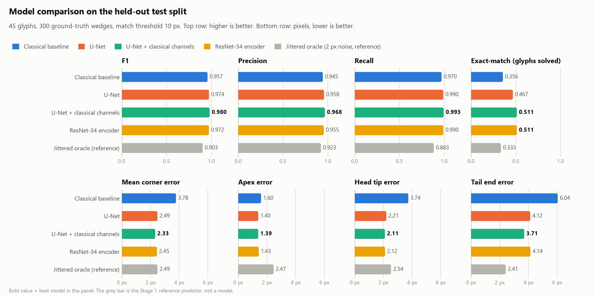
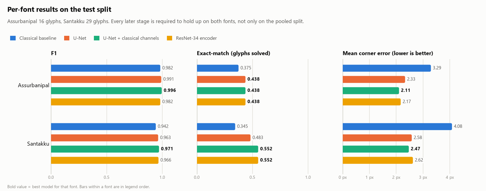
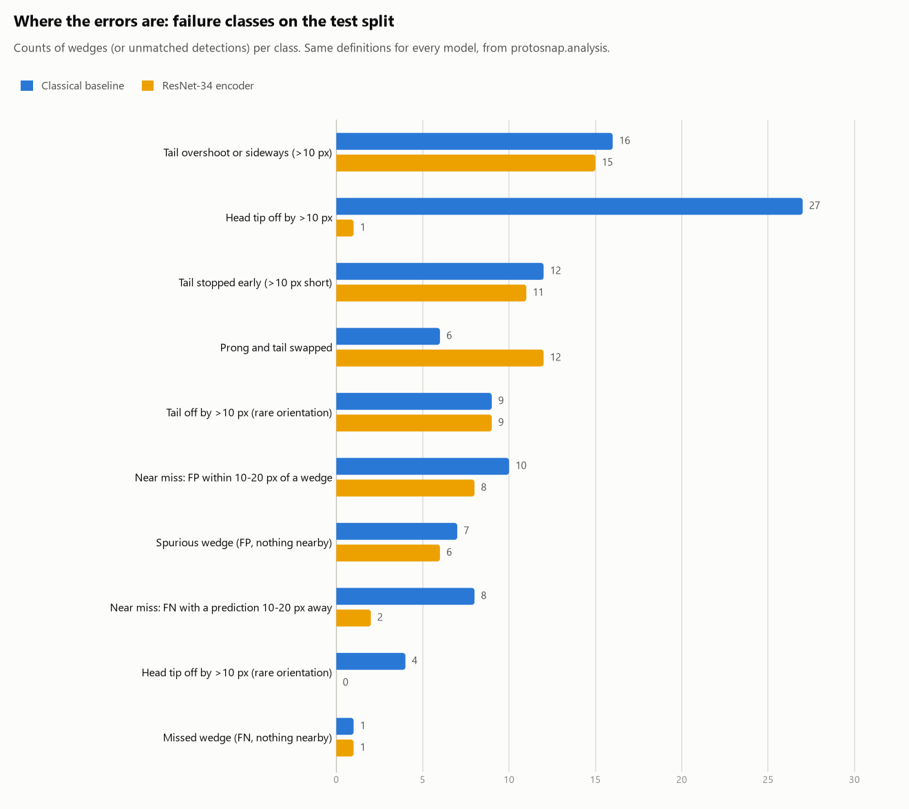
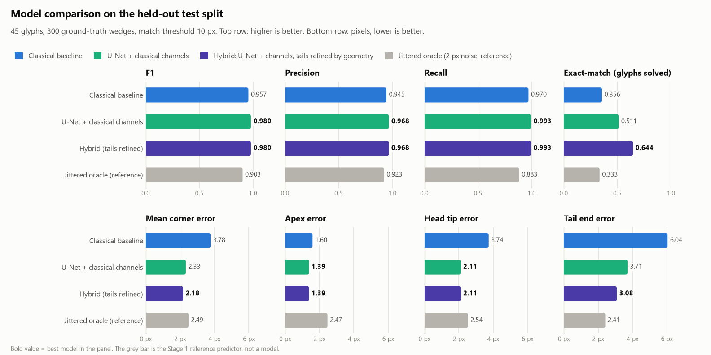
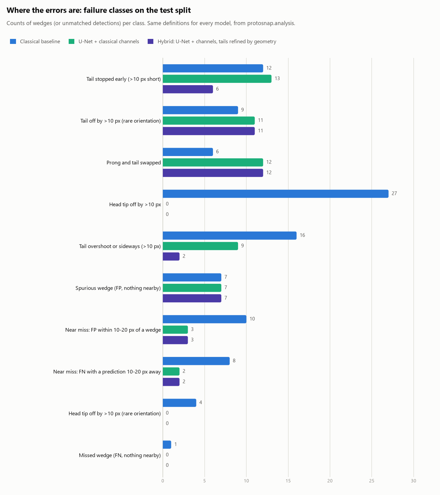
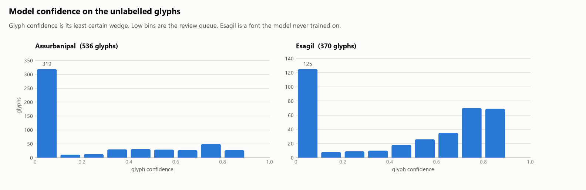
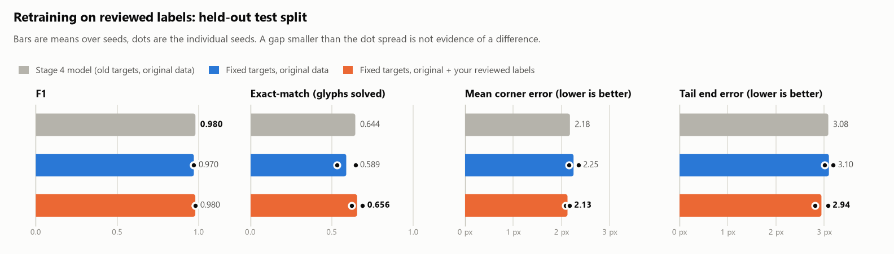

# ProtoSnapVectorMapper

Extends the sign coverage of [ProtoSnap](https://tau-vailab.github.io/ProtoSnap/) by generating the prototype skeletons it needs, automatically, from cuneiform font glyphs.

## Why this exists

[ProtoSnap](https://arxiv.org/abs/2502.00129) (Mikulinsky, Alper, Gordin, Jiménez, Cohen and Averbuch-Elor, ICLR 2025) recovers the internal structure of a cuneiform sign in a photograph of a tablet. It does this by taking a *prototype* of the sign and "snapping" it onto the photographed sign: first a global alignment from diffusion-feature correspondences, then a per-stroke refinement. The recovered structures are then used to condition a generative model, which produces structurally correct synthetic training data and improves sign recognition, most of all on rare signs.

A prototype is two things: a rendered font image of the sign, and a **skeleton** that encodes its strokes. ProtoSnap's skeleton uses a four-keypoint scheme per stroke, three keypoints for the corners of the wedge's triangular head and a fourth for the end of its tail, together with the edges that connect them.

That skeleton is the bottleneck. ProtoSnap can only be applied to a sign that has one, and the skeletons are made by hand: keypoints annotated on each font image and then connected into strokes by experts. Font images are cheap, since a font renders every sign it contains. Skeletons are not. In the data this project started from, three fonts render 2,262 glyph images, but only 449 of them, covering 301 distinct signs in two fonts, have a skeleton. Every other sign is out of ProtoSnap's reach, and the rare signs, where ProtoSnap helps recognition most, are the ones least likely to have been annotated.

Coverage matters in a second direction too. ProtoSnap's authors note that alignment fails when the photographed sign is a structurally different variant from the prototype. Cuneiform changed across two millennia, so a prototype drawn in one period's script is a poor match for a tablet from another. Prototypes in more fonts mean more periods ProtoSnap can work on. The three fonts here are Santakku (Old Babylonian), Assurbanipal (Neo-Assyrian) and Esagil (Neo-Babylonian), and Esagil began with no skeletons at all.

## What this project does

It learns the mapping ProtoSnap's annotators performed by hand: **font glyph image in, prototype skeleton out**. A model trained on the 449 hand-annotated pairs produces skeletons for the glyphs that have none, in the same CSV format as the hand-made ones, so the output drops into ProtoSnap as additional prototypes with no change on that side.

Because a wrong prototype would silently corrupt every alignment made with it, the project does not stop at prediction. Each generated skeleton carries a confidence, a reviewer accepts or corrects it in a drag-and-drop editor, and only reviewed skeletons are promoted to the labelled set, which then retrains the model for the next round.

| | Glyph–skeleton pairs | Distinct signs | Fonts |
|---|---|---|---|
| Hand-annotated, the starting point | 449 | 301 | Santakku, Assurbanipal |
| After the first review round | 539 | 357 | plus Esagil |
| Including machine-generated skeletons awaiting review | 1,458 | 794 | all three |

So the pipeline has already raised reviewed coverage by 56 signs and given Esagil its first 48 prototypes, and has a further 906 generated skeletons queued for review, which would take coverage to 794 signs, more than two and a half times the starting point. On held-out hand-annotated glyphs the shipped model finds 99.7% of wedges at 96.5% precision, places their points 2.2 px from the annotator's on average on a 256 px glyph, and reproduces the entire skeleton, every wedge with every point within 10 px, for 62% of glyphs.

### How it works, in brief

1. **A geometric baseline** (Stage 2) reads the glyph's outline: each wedge head is a small hollow triangle, so enclosed holes in the ink locate heads, and the skeletonized ink is traced to find head tips and tail ends.
2. **A learned detector** (Stage 3), a U-Net, predicts a heatmap of wedge apexes and regresses the other three keypoints from each apex. It beats the baseline on every measure and all but eliminates head-tip errors.
3. **A hybrid** (Stage 4) keeps the network's heads and lets geometry fix its weakest output, the tail end, by tracing the ink line from the apex and letting the network's own tail heatmap vote on where it stops.
4. **A review loop** (Stage 5) runs the hybrid on every glyph without a skeleton, ranks the results by confidence, and feeds reviewed skeletons back into training under guards that keep them out of validation and test.

The rest of this document is the working record of that development: the data, then each stage with its method, results, failed ideas and review gate.

## Quick start

```
python3 -m venv .venv && .venv/bin/pip install -r requirements.lock
.venv/bin/pip install -e . --no-deps

.venv/bin/protosnap reproduce                                   # check this checkout reproduces the recorded scores
.venv/bin/protosnap infer --checkpoint models/shipped.pt        # generate skeletons for glyphs that have none
.venv/bin/protosnap editor                                      # review and correct them at http://localhost:8765
.venv/bin/protosnap promote reports/stage5/review/review_all.csv --corrected data/reviewed --dry-run
.venv/bin/python -m pytest tests -q
```

Reviewed prototypes live in `skeletons/<Font>/`, generated ones awaiting review in `generated/<Font>/`. Both use the original annotation format described under Stage 5, which is what ProtoSnap reads.

## Repository contents

| Path | Contents |
|---|---|
| `prototypes/<Font>/<range>/<hex>.png` | Rendered glyphs. Assurbanipal and Santakku are 256x256. Esagil is variable width at 512px height. |
| `prototypes/metadata.csv` | Per-codepoint table of which fonts contain the glyph, plus the sign name. |
| `skeletons/<Font>/<hex>_adf.csv` | Skeleton points, one row per point, grouped by stroke label. Two layouts exist: `label,x,y` with integers, or `x,y,label` with floats (see Stage 5). |
| `skeletons/<Font>/<hex>_con.csv` | Skeleton connectivity, edges between point indices within a stroke: `label,i,j` or `i,j,label`. |
| `annotations_11.09.2026/` | JSON Lines export of tablet-fragment sign annotations from a cuneiform database: bounding boxes and readings of signs on photographed tablets, the kind of target image ProtoSnap aligns prototypes to. Contains no skeletons or font references and is not used by this pipeline. |

## Data inventory

A usable pair is a codepoint with a PNG and both skeleton files in the same font.

| Font | PNG glyphs | Skeletons | Usable pairs |
|---|---|---|---|
| Assurbanipal | 922 | 161 | 161 |
| Santakku | 922 | 288 | 288 |
| Esagil | 418 | 0 | 0 |
| **Total** | 2262 | 449 | **449** |

Validation already performed on all 449 pairs:

- All PNGs are valid, non-blank 256x256 images. The glyphs are drawn as outlines about 2 to 3 px thick: wedge heads are small hollow triangles with three prongs, not filled shapes.
- All skeleton files are non-empty, have no missing coordinates, and every point lies inside the image box.
- Every connectivity index refers to a valid point within its stroke.
- No two skeletons are identical, and the metadata confirms each font contains each paired glyph.

Facts that shape the design:

- Almost every stroke is a wedge with a fixed 4-point template: three head vertices forming a triangle plus a tail endpoint attached at the apex. Of roughly 2,750 strokes, 2,686 have exactly 4 points and the same four edges. The remaining 71 strokes have 3 or 5 to 8 points.
- Glyphs contain between 1 and 17 strokes.
- The two fonts overlap on 148 codepoints, so only 301 distinct signs are covered. Worse, the fonts share glyph outlines: 247 of the 922 codepoints present in both fonts have byte-identical images, and 70 of the 148 paired codepoints have identical images and identical skeleton files. Only 379 of the 449 pairs are distinct. The codepoint-level split keeps every duplicate inside one split, so there is no leakage, but per-font numbers are partly measuring the same glyphs twice.
- The Assurbanipal glyphs HI (0x1212d) and SHAR2 (0x122b9) are pixel-identical but have different skeletons.
- Many images without a skeleton are blank: 627 in Santakku, where the font lacks the sign, and 177 in Assurbanipal, where the metadata says the sign exists and rendering failed. See Stage 5.

## Approach

The target is a variable-size set of wedge instances, each with four labeled corners. That makes the task keypoint detection with instance grouping rather than classification or fixed-length regression. The plan builds a classical geometric baseline first, then a heatmap-based keypoint CNN, then combines them. Inputs at deployment are more glyphs from the same fonts, so there is no domain shift to manage.

## Development plan

Each stage ends with a review gate that has a concrete artifact to inspect.

### Stage 0. Data foundation (done)

Implemented in the `protosnap` package. Run it with:

```
python3 -m venv .venv && .venv/bin/pip install -r requirements.txt
.venv/bin/python -m protosnap.stage0          # writes data/splits.json and reports/stage0/
.venv/bin/python -m pytest tests -q
```

What it provides:

- `protosnap.data`: indexes the 449 pairs (`find_pairs`), parses both CSVs, and classifies every stroke by graph topology (`classify_stroke`). A stroke becomes a canonical `Wedge(apex, head_a, head_b, tail)` when its four edges form a triangle with one tail attached at the apex. The apex is the degree-3 point; index position is never used because annotators did not keep a consistent order (apex is index 2 in 2,482 strokes, index 1 in 160, index 3 in 37, index 0 in 6). Head corners are ordered so that the cross product of (head_a - apex) and (head_b - apex) is positive in image coordinates, which makes the 4x2 target array unambiguous.
- `protosnap.split`: codepoint-level split, stratified by which fonts contain the codepoint, seed 0, fractions 80/10/10. Saved to `data/splits.json`.
- `protosnap.corrections`: manual and semi-automatic annotation fixes. A correction is a pair of CSVs with the original names under `data/corrections/<Font>/`. When present, `find_pairs` reads them instead of the originals and marks the pair `corrected=True`; the originals are never modified. Pass `corrections=None` to read the raw corpus. Hand-edit the CSVs for a manual adjustment, then re-render with `python -m protosnap.corrections render --font <Font> --codepoint <hex>`.
- `protosnap.render`: skeleton overlay on the glyph and paginated contact sheets.
- `protosnap.stage0`: runs everything and writes `reports/stage0/stats.md` plus contact sheets under `reports/stage0/contact_sheets/`.

Decisions taken on the non-wedge strokes, based on a topology audit of all 2,755 strokes:

| Topology | Count | Handling |
|---|---|---|
| Clean 4-point wedge | 2,685 | Canonical wedge |
| Wedge plus 1 to 4 isolated stray points | 35 | Canonical wedge; stray points recorded as `orphans` and drawn as red crosses |
| 3-point closed triangle, no tail | 34 | Kept as `kind="triangle"`, excluded from `Skeleton.wedges`, drawn magenta |
| 4 points with a self-loop edge (Santakku DUG, Stroke 5) | 1 | Kept as `kind="malformed"`, excluded, drawn red |

So the wedge target set is 2,720 wedges across 449 glyphs. The 23 glyphs with any flagged stroke are listed in the stats report and rendered at 2x on the `flagged_*.png` sheets. One of them, DUG (Santakku 0x12081), has a stroke with a self-loop edge and still needs a decision.

HI TIMES BAD (Santakku 0x12130) has been corrected. Its six strokes were annotated with the two head corners and the tail endpoint but no apex, so they parsed as triangles spanning the glyph. The apex is reconstructed on the axis from the head midpoint toward the tail at 0.45 head widths, which is the median of that measurement over the clean wedges (p10 0.33, p90 0.62). The correction lives in `data/corrections/Santakku/` and a before/after render is at `reports/stage0/corrections/Santakku_0x12130.png`. To regenerate or apply the same repair to another glyph:

```
.venv/bin/python -m protosnap.corrections reconstruct --font Santakku --codepoint 0x12130 [--k 0.45] [--strokes 1,2]
```

With the correction applied the wedge target set is 2,726 wedges and 22 glyphs remain flagged. Seven other triangle strokes are elongated the same way and are candidates for the same repair after a look at the contact sheet: Santakku 0x12032 stroke 3, 0x1218d stroke 4, 0x12224 stroke 4, 0x122cb stroke 1, and 0x1238f strokes 5 to 7. The remaining triangles are compact and look like genuine head-only marks, so they stay excluded. The Assurbanipal SHAR2 codepoint (0x122b9) is pinned to train because its image is identical to HI.

Review gate: reviewers eyeball the contact sheets for annotation errors and confirm the wedge canonicalization, the treatment of triangles, and the split policy.

### Stage 1. Evaluation harness (done)

Implemented in `protosnap.metrics`, with reference results from:

```
.venv/bin/python -m protosnap.stage1        # writes reports/stage1/stats.md, json/, gallery/
```

Metric definition, frozen for the rest of the project:

- **Prediction format.** A list of canonical `Wedge` objects per glyph. Ground truth is `Skeleton.wedges`, so triangle and malformed strokes are not evaluated.
- **Matching.** Hungarian assignment between predicted and ground-truth wedges on apex distance. An assigned pair counts as a match only if the apex distance is at most the match threshold, 10 px by default. The median head width is about 21 px, so this is roughly half a wedge head.
- **Wedge-level numbers.** Micro precision, recall and F1 over all wedges in the split.
- **Corner error.** For matched wedges, the mean Euclidean distance over the four points in canonical order (apex, head_a, head_b, tail), reported overall and per point type.
- **Glyph exact-match.** A glyph is exact when it has no false positives, no false negatives, and every point of every matched wedge is within the match threshold.
- **Breakdown.** Every number is reported per split (train, val, test) and per font.

Reference scores on the test split (45 glyphs, 300 wedges):

| Predictor | Precision | Recall | F1 | Corner err (px) | Exact |
|---|---|---|---|---|---|
| null (predicts nothing) | 0.000 | 0.000 | 0.000 | nan | 0.000 |
| oracle (ground truth) | 1.000 | 1.000 | 1.000 | 0.00 | 1.000 |
| jittered oracle (2 px noise, 10% dropped, 5% spurious) | 0.923 | 0.883 | 0.903 | 2.49 | 0.333 |

The oracle proves the harness has no self-disagreement, and the jittered oracle shows the numbers a nearly-right model produces: a 2 px per-point noise level costs two thirds of the exact-match rate, so exact-match is the strict headline number and F1 plus corner error are the diagnostic ones.

Two edge cases to keep in mind when reading results. A glyph whose strokes are all triangles has zero evaluable wedges, so any predictor that outputs nothing for it scores exact; that is why null shows 0.003 exact on train (MUSH, Santakku 0x12232). And precision is reported as 0 rather than undefined when a predictor outputs nothing.

The failure gallery (`reports/stage1/gallery/`) shows the worst glyphs of a run with ground truth on the left and the prediction on the right, matched wedges in blue and unmatched in red. `EvalResult.worst()` ranks by false positives plus false negatives, then corner error.

Review gate: reviewers sign off on the metric definition, the 10 px threshold and the reporting format. This freezes what "better" means for the rest of the project.

### Stage 2. Classical baseline (done)

Implemented in `protosnap.classical`, tuned by `protosnap.tune`, scored by:

```
.venv/bin/python -m protosnap.tune          # coordinate descent on train+val -> reports/stage2/tuned_params.json
.venv/bin/python -m protosnap.stage2        # scores all splits -> reports/stage2/stats.md, gallery/
```

**How it works.** The glyphs are thin outlines, so the pipeline is line-based rather than region-based. The ink is skeletonized and turned into a graph of junction clusters, endpoints and the paths between them. Every small enclosed hole in the ink is a wedge-head interior (99% of ground-truth heads have one within 8 px; median area 10 px). The junctions ringing a hole are the head's triangle corners. Each corner is tried as the apex: its tail is the arm leaving it along the axis away from the opposite side, the prongs leave the other two corners and are followed at most 20 px, and the tail is followed through near-straight junctions until it ends in air or reaches another wedge's head. The candidate with the lowest cost wins. The decisive cost terms turned out to be two orientation priors measured on the training split: 95% of tails point within the arc from 40° above horizontal-right round to 130°, and only 2% of prongs point into the arc from -20° to 120°. Before those priors the mean corner error on validation was 8.4 px; after them, 4.6 px. An opening-angle prior and a prong-extends-its-side cue were both tried and tuned to zero weight.

**Geometry fixes after the first baseline.** Four changes to how the triangle and its points are derived, each checked on validation and test:

1. *Prong direction from the head centre.* Prongs leave a head radially. Measured on the training split, the line from the hole centroid through a corner predicts the prong direction with 15° median deviation; the apex-to-corner line I used first deviates 42°. Switching the reference direction was the single largest gain (test exact-match 0.289 to 0.400 on its own).
2. *Cost-ranked suppression.* One head seen through two adjacent holes produced two wedges with apexes 5 to 9 px apart. Wedges are now ranked by assembly cost and a wedge is dropped when a cheaper one with a similar tail direction shares two of its corner junctions or sits within 6 px at the apex. Stacked heads with different tails survive.
3. *Tails crossing a head.* A tail that reaches another wedge's head now continues across it only if the line beyond is not claimed as a tail or prong by any other wedge and does not merge into that wedge's tail. Every skeleton branch a wedge uses is recorded to make that test. An unconditional pass-through made 31 tails worse and 6 better, because annotators stop a tail at the next head even when the ink line continues, so the claim test is what makes the rule safe.
4. *Stop reasons.* Every trace records why it stopped (endpoint, head, turn, hop limit, length cap), which is what made the tail analysis above possible.

Two candidates were tried and rejected on the data: an assembly-cost threshold to drop spurious wedges (matched and spurious costs overlap) and hole shape features (non-head holes are only 4% of small holes and their shapes overlap with heads).

**Tuning.** The plan said tune on validation only. With this many parameters, 45 validation glyphs let a single extra wedge outweigh a clear improvement in corner error, and the search flipped the prong-direction fix back off even though it plainly helped on test. The classical model never fits on the training split, so the tuner now uses train plus validation, 404 glyphs, with objective F1 plus exact-match minus corner error in px/100. Test remains untouched. The tuned values are the code defaults.

**Held-out scores** (match threshold 10 px):

| Split | Font | Glyphs | Precision | Recall | F1 | Corner err (px) | Apex | Heads | Tail | Exact |
|---|---|---|---|---|---|---|---|---|---|---|
| val | all | 45 | 0.965 | 0.977 | 0.971 | 4.32 | 1.73 | 4.55 | 6.44 | 0.533 |
| test | all | 45 | 0.945 | 0.970 | 0.957 | 3.78 | 1.60 | 3.74 | 6.04 | 0.356 |
| test | Assurbanipal | 16 | 0.982 | 0.982 | 0.982 | 3.29 | | | | 0.375 |
| test | Santakku | 29 | 0.923 | 0.962 | 0.942 | 4.08 | | | | 0.345 |

Before the geometry fixes the test split scored F1 0.956, corner error 4.36 px, heads 4.66 px, tail 6.44 px and exact 0.289. For scale, the jittered oracle from Stage 1 scores F1 0.903 and exact 0.333 on the same split.

**Failure classes on the test split** (300 ground-truth wedges, 291 matched), before and after the fixes:

| Class | Before | After | Remaining cause |
|---|---|---|---|
| Head tip misplaced by more than 10 px | 57 | 27 | Prongs meeting a neighbouring stroke at a junction that is not where the annotator ended the prong. Needs ink-level tip refinement or learning. |
| Head tip wrong because of a rare wedge orientation | (in above) | 9 | The orientation prior rejects the 5% of wedges whose tail points up or left. Relaxing it costs more than it gains. |
| Tail stopped early | 24 | 12 | Crossings the claim test still refuses. |
| Tail sideways or overshooting | 18 | 16 | Junctions where the straightest continuation is the wrong stroke. Learning. |
| Tail wrong because of a rare orientation | (in above) | 9 | As for heads. |
| Near-miss pairs, one FP plus one FN | 7 + 13 | 8 + 10 | Mostly rare orientations and one glyph (LUL) with 25 px prongs. |
| Spurious wedge | 7 | 7 | Enclosed gaps that look like heads, plus 3 in a glyph whose ground truth is triangles only, so any prediction there counts as spurious. |
| Prong and tail swapped | 6 | 1 | |

What is left is dominated by the orientation prior (18 of the large errors), by tips that end at the wrong junction, and by annotation conventions that vary glyph to glyph. Those are the cases the Stage 3 model should target.

**Known limitation.** Stacked heads, where a tiny wedge's head sits directly on the next wedge's head as in sign A (0x12000), still get merged into one wedge.

Review gate: the held-out score above, the gallery at `reports/stage2/gallery/`, and this failure-class note.

### Stage 3. Learned keypoint model (done)

Implemented in `protosnap.learned`. Train, then build the comparison report:

```
.venv/bin/python -m protosnap.learned.train --name unet
.venv/bin/python -m protosnap.learned.train --name unet_xc --extra-channels
.venv/bin/python -m protosnap.learned.train --name resnet34 --encoder resnet34 --lr 5e-4
.venv/bin/python -m protosnap.stage3        # reports/stage3/stats.md, gallery/, per-run curves.png, reports/charts/
.venv/bin/python -m protosnap.charts        # redraw the bar charts alone from the saved result JSON (--split val|test)
tail -f reports/stage3/train_*.log          # follow a run live
```

**Design.** A CenterNet-style detector fitted to the wedge structure, at full 256x256 output resolution. The network predicts an apex heatmap, and at each apex pixel regresses the offsets to the sub-pixel apex, the two head tips and the tail end. Two auxiliary heatmaps, one for all head tips and one for all tail ends, add supervision and let the decoder snap each regressed point to the nearest heatmap peak within 5 px. Decoding is peak-picking on the apex map, so grouping corners into wedges is free: every wedge is read out at its own apex. This replaced the plan's per-corner heatmaps with offset grouping, which would have needed a separate association step.

Three details came from the earlier stages:

- *No flips and only small rotations* (8°) in augmentation. Stage 2 showed that orientation carries role information, since 95% of tails point right, down or down-right, so the model is allowed to learn it. Other augmentation: scale, shear, translation, stroke thickening and thinning, blur, gamma and noise.
- *Ignore regions.* Strokes that are not canonical wedges (tail-less triangles, the malformed stroke) are real heads in the image with no wedge label. The heatmap losses ignore a 14 px disc around their points instead of training them as negatives.
- *Classical channels variant.* `--extra-channels` feeds the ink distance transform and the thinned skeleton, the same features the Stage 2 baseline runs on, as two extra input channels.

Training: AdamW with a one-cycle schedule, mixed precision, batch 16, 60 epochs of 4 augmented passes each, focal loss on heatmaps and L1 on offsets. A run takes about 20 minutes on an RTX 4060. The checkpoint with the best validation objective (F1 plus exact-match minus corner error in px/100, the same objective as the classical tuner) is kept, and the decode threshold and snap radius are then tuned on validation. Test is scored once per checkpoint.



**Test split scores** (45 glyphs, 300 wedges, match threshold 10 px):

| Model | Params | Precision | Recall | F1 | Corner err (px) | Apex | Heads | Tail | Exact |
|---|---|---|---|---|---|---|---|---|---|
| Classical baseline (Stage 2) | | 0.945 | 0.970 | 0.957 | 3.78 | 1.60 | 3.74 | 6.04 | 0.356 |
| U-Net | 7.9M | 0.958 | 0.990 | 0.974 | 2.49 | 1.40 | 2.21 | 4.12 | 0.467 |
| U-Net + classical channels | 7.9M | 0.968 | 0.993 | 0.980 | 2.33 | 1.39 | 2.12 | 3.71 | 0.511 |
| ResNet-34 encoder, ImageNet-pretrained | 24.6M | 0.955 | 0.990 | 0.972 | 2.45 | 1.43 | 2.12 | 4.14 | 0.511 |

**Review gate.** The model selected on validation is the ResNet-34 (validation exact-match 0.644 versus 0.578 and 0.622). Against the classical baseline on test, per font:

| Font | Classical F1 | Learned F1 | Classical err | Learned err | Classical exact | Learned exact |
|---|---|---|---|---|---|---|
| Assurbanipal | 0.982 | 0.982 | 3.29 | 2.17 | 0.375 | 0.438 |
| Santakku | 0.942 | 0.966 | 4.08 | 2.62 | 0.345 | 0.552 |



The learned model wins on the combined objective for both fonts, so the gate passes. On Assurbanipal F1 is tied and the gain is all in point placement.

**What the variants say.** All three learned models beat the baseline by a clear margin, and the differences among them are within noise: one glyph is 2.2 points of exact-match on a 45-glyph split. The pretrained backbone does not help measurably on these synthetic line drawings, and the classical input channels are at best a small gain (best on test, middle on validation). The plain 7.9M U-Net is the sensible default for Stage 4; the ResNet is three times the size for no demonstrated benefit.

**Failure classes on test**, same definitions for both models (`protosnap.analysis`):

| Failure class | Classical | Learned (ResNet-34) |
|---|---|---|
| Head tip off by more than 10 px | 31 | 1 |
| Prong and tail swapped | 6 | 12 |
| Tail stopped early | 12 | 11 |
| Tail overshoot or sideways | 16 | 15 |
| Tail wrong, rare orientation | 9 | 9 |
| Near-miss pairs (FN + FP) | 8 + 10 | 2 + 8 |
| Missed wedge | 1 | 1 |
| Spurious wedge | 7 | 6 |



The learned model essentially solves head tips, the classical model's largest error class, and recall is near perfect. It does not improve tails: a tail end is regressed from the apex across up to 100 px and only snapped within 5 px, and the annotation convention for where a tail stops is genuinely inconsistent. It also swaps prong and tail more often than the orientation-prior baseline does. Those two classes are the target for Stage 4, where the classical tracer can supply tail ends and the orientation prior can arbitrate roles.

**An evaluation artifact to decide on.** Five of the six spurious wedges are in one glyph (Santakku 0x1238f) and three more false positives are in MAH (0x12224). In both, the model finds real wedges that the ground truth records as tail-less triangles, which the metric excludes, so correct detections count as false positives. The training loss already ignores those regions; the metric does not. Reported precision is therefore a lower bound for both models. The clean fix is to ignore predictions whose apex lies near a non-wedge stroke, or to repair those annotations with `protosnap.corrections`. I have not changed the frozen Stage 1 metric; this needs a reviewer decision.

Review gate: `reports/stage3/stats.md` (full per-font tables for every run and split), `reports/stage3/<run>/curves.png`, and the gallery at `reports/stage3/gallery/`.

### Stage 4. Hybrid refinement (done)

Implemented in `protosnap.hybrid`, reported by:

```
.venv/bin/python -m protosnap.stage4        # reports/stage4/stats.md, json/, gallery/, reports/charts/stage4_*.png
```

**Proposer and refiner.** The U-Net with classical input channels proposes wedges; classical geometry refines them. Stage 3 showed the network already owns heads (large head-tip errors 0 against the baseline's 31), so its apexes and head tips are kept untouched. Its weak point is the tail end, which it regresses from the apex across up to 100 px.

**The refinement that works: a heatmap vote along the traced line.** For each wedge the skeleton is traced from the apex along the network's tail direction, through near-straight junctions, collecting every node the ink line passes. Each node is scored by the network's own tail-end heatmap near it, down-weighted by distance from the regressed tail, and the tail moves to the best-supported node if that beats the support at the regressed position. The division of labour is the point: a long-range regression is the network's weakest output, a local "a tail ends here" heatmap is one of its strongest, and the skeleton supplies the association between an apex and the candidate ends on its own line.



**Ablation on the test split** (settings chosen on validation; frozen Stage 1 metric):

| Configuration | F1 | Corner err (px) | Heads | Tail | Exact |
|---|---|---|---|---|---|
| Classical baseline (Stage 2) | 0.957 | 3.78 | 3.74 | 6.04 | 0.356 |
| Learned, U-Net + classical channels (Stage 3) | 0.980 | 2.33 | 2.11 | 3.71 | 0.511 |
| Hybrid, ink check only | 0.980 | 2.33 | 2.11 | 3.71 | 0.511 |
| Hybrid, tail snapped to the nearest traced node | 0.980 | 2.39 | 2.11 | 3.92 | 0.511 |
| **Hybrid, tail by heatmap vote along the trace (shipped)** | **0.980** | **2.18** | **2.11** | **3.08** | **0.644** |
| ... plus head tips snapped to skeleton endpoints | 0.980 | 2.27 | 2.29 | 3.08 | 0.644 |
| ... plus orientation swap rule | 0.980 | 2.31 | 2.35 | 3.16 | 0.644 |

What the ablation says:

- The naive refinement, snapping the tail to the skeleton node nearest the network's estimate, makes things worse. The network's tail is already within 1.3 px at the median, so snapping adds noise to the many good tails and follows the network's wrong guess on the bad ones.
- The heatmap vote moved 25 validation tails, 20 for the better and 4 for the worse, and lifts test exact-match from 0.511 to 0.644.
- Snapping head tips to skeleton endpoints hurts: the network's tips are better than the skeleton's. The orientation swap rule hurts too, because most swaps are genuinely rare orientations.
- The ink check never fires. The network does not hallucinate wedges off the ink.

Per font on test the hybrid improves both: Assurbanipal exact-match 0.438 to 0.688 and tail error 3.59 to 2.63 px; Santakku 0.552 to 0.621 and 3.78 to 3.36 px.



**What is left.** On normally oriented wedges the hybrid halves the tail errors (stopped early 13 to 6, overshoot or sideways 9 to 2). It does not touch the 12 prong-tail swaps or the 11 rare-orientation tails. In those the network is confidently wrong about which arm is the tail, with high heatmap support at its own answer and almost none at the true end, and the classical model is wrong on the same wedges, so no combination of the two can fix them. They need more labelled examples of rare orientations, which is what Stage 5 should collect first.

**Confidence.** Each wedge gets a confidence: the weakest of the network's apex score and its heatmap support at the final tail end and both head tips, times 0.6 when the tail points in a rare direction. A glyph's confidence is its least certain wedge. The apex score alone is nearly uninformative, which is why the heatmap terms matter:

| Split | Wedge AUROC, confidence | Wedge AUROC, apex score only | Glyph AUROC, confidence |
|---|---|---|---|
| val | 0.796 | 0.582 | 0.882 |
| test | 0.719 | 0.520 | 0.867 |

Triage on test, sorting glyphs by confidence (a glyph is fully correct when every wedge is matched with all points within 5 px):

| Most confident | Glyphs | Fully correct |
|---|---|---|
| 25% | 11 | 0.727 |
| 50% | 22 | 0.545 |
| 100% | 45 | 0.333 |

So the confidence is good enough to order the Stage 5 review queue: the top quarter is mostly right and the bottom half is where an annotator's time goes.

**Non-wedge strokes.** The Stage 0 decision stands: tail-less triangles and the malformed stroke are not wedge targets, and training ignores the regions around them. To stop correct detections there from counting as false positives, `evaluate(..., ignore_non_wedge=14)` provides a secondary metric that, after matching, skips *unmatched* predictions within 14 px of a non-wedge stroke. Under it the hybrid scores precision 0.990, F1 0.992 and exact-match 0.667 on test. The frozen metric remains the headline; this number is reported beside it.

**Ship decision.** The hybrid with the heatmap vote, on the U-Net with classical channels. It wins on validation (exact-match 0.689 against 0.622, tail error 4.29 against 4.82 px) and on test, for both fonts, costs one skeletonization per glyph, and changes nothing but tail ends.

Review gate: the ablation table above and in `reports/stage4/stats.md`, the ship decision, and the gallery at `reports/stage4/gallery/`.

### Stage 5. Inference and labeling loop (done, awaiting human review)

Implemented in `protosnap.stage5`:

```
.venv/bin/python -m protosnap.stage5 run                                   # generated/, reports/stage5/
.venv/bin/python -m protosnap.stage5 acceptance reports/stage5/review/review_assurbanipal_santakku_random.csv
.venv/bin/python -m protosnap.stage5 promote <review.csv> [--corrected data/reviewed] [--dry-run]
```

**The unlabeled set is much smaller than planned.** The plan assumed 1,395 unlabeled Assurbanipal and Santakku glyphs. A survey of the images shows otherwise:

| Font | Images without a skeleton | Blank image | Identical to a human-labelled glyph | Left for the model |
|---|---|---|---|---|
| Assurbanipal | 761 | 177 | 6 | 578 |
| Santakku | 634 | 627 | 7 | 0 |
| Esagil | 418 | 0 | 0 | 418 |

Santakku is effectively fully labelled: 627 of its images are blank because the font lacks those signs (the metadata says so), and the other 7 are byte-identical to a labelled Assurbanipal glyph, so their human skeletons were copied rather than predicted. The 177 blank Assurbanipal images are a different matter: the metadata says the font contains those signs, so the rendering upstream failed. They are listed in `reports/stage5/blank_images.csv` for re-rendering. That leaves 578 Assurbanipal glyphs plus the 418 Esagil glyphs, 996 predictions and 9,341 wedges in all.

**Esagil preprocessing.** Esagil turned out to be the same outline style and wedge design as the training fonts, rendered about 6.4 times larger at variable width. `prepare_image` resamples it so the 512 px em height becomes 80 px, centres it on a 256 px canvas, and scales very wide signs down further to fit. At that scale the Esagil sign A carries 604 ink pixels against 610 for the training rendering of the same sign. The transform is an exact inverse (largest round-trip error 1e-13 px), and exported coordinates are in the original full-resolution image; an overlay on the original images confirms they land on the ink.

**Output.** `generated/<Font>/<hex>_adf.csv` and `_con.csv`, written the way the original annotations are written (`protosnap.skeleton_io`). The originals come in two layouts, and a generated file uses the dominant layout of its font:

| | Layout A | Layout B |
|---|---|---|
| Originals using it | all 288 Santakku files, 70 Assurbanipal | 91 Assurbanipal (the majority there) |
| Used for generated | Santakku, Esagil | Assurbanipal |
| Point file header | `label,x,y` | `x,y,label` |
| Edge file header | `label,i,j` | `i,j,label` |
| Coordinates | integers | full-precision floats |
| Edge rows per stroke | 2-0, 2-1, 2-3, 0-1 | 0-1, 0-2, 1-2, 2-3 |

Both layouts share CRLF line endings, a final newline, `Stroke N` labels numbered from 1, and four points per wedge in the order head, head, apex, tail. Esagil has no originals, so it uses layout A, the one layout both annotated fonts share. Two ordering conventions are followed as closely as the originals allow, since neither is strict there: strokes run left to right by apex (71% of consecutive original strokes do) and the upper head tip is listed first, the left one on ties (67% of originals). The editor saves in the same format. `python -m protosnap.skeleton_io check <dir>` reports any file that deviates and `convert` rewrites files in place; converting to layout A moves a point by at most 0.5 px, which is the integer rounding, and converting to layout B changes nothing. The 13 files copied from human annotations keep their original bytes. `skeletons/` is never written by `run`. `generated/manifest.csv` has one row per glyph in review order with confidence, wedge count, doubtful wedges, rare-orientation wedges, off-ink tails and clamped points; `generated/wedges.csv` has one row per wedge. All 1,009 written skeletons were reloaded through the normal loader and every stroke parsed as a canonical wedge.

**One new check from looking at the output.** Review sheets showed a few tails drawn as long diagonals across white space. A tail is an ink line: on labelled data 99% of true tails and essentially all correct predictions lie fully on ink, while 10% of wrong tails do not. So an off-ink tail is almost certainly wrong. It caps the wedge's confidence at 0.05 and is flagged in the manifest. Clipping such tails back to the ink was tried and rejected: it lowered test exact-match from 0.644 to 0.600, because true tails cross the hollow interiors of other heads.



**How much correction work there is.** Glyph confidence is the weakest wedge, and these glyphs are much more complex than the labelled set (median 11 wedges against 5), so most glyphs score near zero even when a single wedge is in doubt. The useful number is doubtful wedges per glyph, below 0.3 confidence:

| Font | Wedges | Doubtful | Glyphs with 0 doubtful | 1 | 2 | 3 or more |
|---|---|---|---|---|---|---|
| Assurbanipal | 6,398 | 1,313 (21%) | 94 | 164 | 117 | 203 |
| Esagil | 2,943 | 539 (18%) | 142 | 126 | 81 | 69 |

So the annotator's job is checking roughly 1,850 flagged wedges, not redrawing 996 glyphs. The queue is ordered by glyph confidence with ties broken by doubtful-wedge count.

**What the confidence means.** On the 90 labelled validation and test glyphs the model never trained on: glyphs below 0.3 confidence are fully correct 15% of the time, 0.3 to 0.6 are 62%, above 0.6 are 92%. That calibration applies to Assurbanipal. It does not transfer to Esagil, a font the model never saw, so Esagil's acceptance rate has to come from the review.

**Review packs**, in `reports/stage5/review/`: for each of the two groups (Assurbanipal, Esagil) a random pack of 48 glyphs to estimate the overall acceptance rate and a lowest-confidence pack of 48 where correction pays most. Each pack is a set of contact sheets plus a CSV with an empty `accept` column. Fill it with y or n, run `acceptance` for the rate overall and per confidence band, then `promote` to copy accepted skeletons into `skeletons/`. A hand-corrected file placed under `--corrected` wins over the generated one. `promote` never overwrites an existing skeleton and adds new codepoints to the training split only, so validation and test stay fixed and later retraining remains comparable. Retraining is then the Stage 3 command unchanged.

**Correcting a skeleton by hand.** `protosnap.editor` is a local drag-and-drop editor, so nobody has to edit coordinates in a CSV:

```
.venv/bin/python -m protosnap.editor                                  # every generated skeleton
.venv/bin/python -m protosnap.editor --only rejected                  # just the rows marked n
.venv/bin/python -m protosnap.editor --font Esagil --only unreviewed
# then open http://localhost:8765
```

With no `--review` argument the editor works from a master review file, `reports/stage5/review/review_all.csv`, with one row for each of the 1,009 skeletons under `generated/` (996 model predictions and the 13 copies of human labels). It is created on first start, refreshed from the manifest on every start, and picks up decisions already recorded in the pack CSVs without ever overwriting a decision of its own. The sidebar filters by font and by status (open, rejected, accepted, corrected), sorts by review order, doubtful-wedge count, confidence or codepoint, and shows progress. `Y` accepts, `X` rejects, `N` jumps to the next undecided glyph. `acceptance` and `promote` take the master file like any other review CSV. Rerunning `stage5 run` rebuilds the pack CSVs but keeps any accept and notes already in them.

It shows the glyph with its wedges; drag any apex, head tip or tail end, hold Shift on the apex to move a whole wedge, add or delete wedges, and swap a tail with a head tip in one click (the fix for the prong-tail swap class). Wedges the model doubts are drawn in orange with their confidence listed. Saving writes `data/reviewed/<Font>/<hex>_adf.csv` and `_con.csv` in original-image coordinates, verifies the file reloads as canonical wedges, and marks the review row accepted with a "corrected in editor" note. It can also record accept or reject for unreviewed rows, so a whole pack can be done inside it. Omit `--review` to browse every generated glyph in queue order; `--only unreviewed` lists rows still blank. Nothing under `skeletons/` or `generated/` is modified: `promote ... --corrected data/reviewed` is the step that publishes. The server listens on 127.0.0.1 only.

**Reviewer results so far** (the two lowest-confidence packs, the model's worst glyphs):

| Pack | Reviewed | Accepted |
|---|---|---|
| Assurbanipal, 48 lowest-confidence | 48 | 42 (87.5%) |
| Esagil, 48 lowest-confidence | 48 | 45 (93.8%), and the 3 rejects have since been corrected in the editor |

Even the bottom of the queue is mostly usable, so the confidence score is far more pessimistic than a human's judgement of acceptability: it was calibrated against an exact 5 px criterion on every point, which is stricter than "this skeleton is right". The reviewer's notes on the rejects all describe tails, cut short at a perpendicular crossing or attached to the end of another wedge's tail, which is the tail class Stage 4 identified. The two random packs are still to be filled in; they give the unbiased overall rate.

**Promotion and retraining (round 1 closed).** The 90 accepted glyphs, 42 Assurbanipal and 48 Esagil with 27 corrected by hand, were promoted into `skeletons/` and logged in `data/promoted.csv`. Promoted labels differ in kind from the original annotations, so three guards apply:

- *Provenance.* `find_pairs` returns only the original 449 human-annotated pairs unless asked for `include_promoted=True`, so every earlier stage and every evaluation is unchanged.
- *No leakage.* A promoted glyph is trained on only if its codepoint is in the training split. Five share a codepoint with validation; they are published as labels but never trained on.
- *No self-grading.* Promoted labels never enter validation or test. Most were accepted as the model produced them, so scoring against them would grade the model on its own output. Both sets are still exactly 45 glyphs.

The training set grew from 359 to 444 glyphs, and the loader now rescales Esagil images and labels into model space, so the model trains on Esagil for the first time.

*A training bug found on the way.* The focal loss counts a pixel as positive only above 0.99, but Gaussian peaks were centred on exact sub-pixel coordinates, so after augmentation only about a quarter of wedges produced any positive pixel. Peaks are now centred on the nearest pixel with the offset regression carrying the sub-pixel part, and every wedge produces a positive. The experiment below separates this fix from the new labels.



All checkpoints scored as the shipped hybrid on the frozen test split, two seeds per condition (mean, range in brackets):

| Model | F1 | Corner err (px) | Tail | Exact-match |
|---|---|---|---|---|
| Stage 4 model (old targets, original data), one seed | 0.980 | 2.18 | 3.08 | 0.644 |
| Fixed targets, original data | 0.970 (0.970 to 0.970) | 2.25 (2.15 to 2.35) | 3.10 | 0.589 (0.533 to 0.644) |
| Fixed targets, original + reviewed labels | 0.980 (0.979 to 0.980) | 2.13 (2.09 to 2.17) | 2.94 | 0.656 (0.622 to 0.689) |

Read honestly:

- The target fix on its own did not improve held-out scores. It is the correct loss, but on this test set it is neutral to slightly negative, within seed noise.
- The reviewed labels help against the same-recipe baseline on every measure, but the exact-match ranges overlap, so on this 45-glyph test set the gain is suggestive, not proven. Against the Stage 4 model it is a tie.
- That is expected: the test set is drawn from the simple, already-annotated signs, while the new labels are complex Assurbanipal signs and Esagil. The effect shows where the labels came from. On a fixed sample of still-unreviewed glyphs, the share of tails that leave the ink, a model-independent error signal, fell from 6.1% to 2.6% on Assurbanipal and from 2.1% to 1.2% on Esagil against the same-recipe baseline, and the share of wedges the model itself doubts roughly halved on both fonts.
- One baseline seed tied for the best validation score and was the worst on test and on the proxies. Validation on 45 glyphs is that noisy, which is why there are two seeds.

**Round 2.** The checkpoint chosen on validation (`checkpoints/retrain/plus_s1`) re-predicted the 906 glyphs not yet reviewed; promoted glyphs are skipped. Round 1 outputs are archived in `generated_round1/` and `reports/stage5/round1/`.

| | Round 1 | Round 2 |
|---|---|---|
| Assurbanipal: doubtful wedges | 21% | 12% |
| Assurbanipal: glyphs with no doubtful wedge | 94 of 578 | 193 of 536 |
| Esagil: doubtful wedges | 18% | 9% |
| Esagil: glyphs with no doubtful wedge | 142 of 418 | 228 of 370 |
| Esagil: median glyph confidence | 0.02 | 0.57 |
| Esagil: glyphs with a point clamped to the image | 99 | 35 |

A caution on reading those numbers: confidence is the model's own estimate. On held-out labelled glyphs the retrained model's top band, above 0.6, is fully correct 73% of the time, down from 92% for the round 1 model, so part of the rise is overconfidence. The real measure of round 2 is the acceptance rate of the next review. The six glyphs rejected in round 1 were reopened with a note, since their predictions changed.

**What remains for a human.** Reviewing round 2 in the editor. The random packs give the unbiased acceptance rate; the wedges worth labelling first are still those with rare tail orientations, the one failure class neither retraining nor geometry has moved (10 swaps and 10 rare-orientation tails on test, as before). The first labels worth collecting are wedges with rare tail orientations (159 glyphs have one), since Stage 4 showed that is where both models fail and only more examples will help.

Review gate: the four review packs, `reports/stage5/stats.md`, and the recorded acceptance rate.

### Stage 6. Packaging (done)

**One command.** Everything runs through `protosnap <command>` (or `python -m protosnap <command>`); each command forwards its options to the module that implements it, so `protosnap <command> --help` shows that command's own options.

| Command | What it does |
|---|---|
| `reproduce` | Verify the data, then re-score the baseline and the shipped models against recorded values |
| `infer` | Generate skeletons for every glyph that has none (writes `generated/`) |
| `editor` | Review and correct generated skeletons in the browser |
| `acceptance`, `promote` | Acceptance rate of a review CSV; publish accepted and corrected skeletons into `skeletons/` |
| `train`, `compare` | Train the wedge detector; compare groups of checkpoints over seeds |
| `format`, `correct` | Check or convert CSVs to the original annotation layout; repair an original annotation without modifying it |
| `charts`, `tune`, `stage0` to `stage4` | Redraw charts; tune the classical baseline; rebuild any stage report |

**Environment.** `requirements.lock` pins every package to the exact version the results were produced with (Python 3.11, PyTorch 2.14 with CUDA 13 wheels, Linux x86-64); `requirements.txt` and `pyproject.toml` give the minimum versions for other platforms. Install with:

```
python3 -m venv .venv
.venv/bin/pip install -r requirements.lock      # or: -r requirements.txt
.venv/bin/pip install -e . --no-deps            # provides the `protosnap` command
```

**Shipped weights.** `checkpoints/` is git-ignored, so a clone would have no model. `models/` is tracked and holds two sets of weights, about 32 MB each:

- `models/shipped.pt`, the current model, trained on the original annotations plus the first round of reviewed labels. This is what `protosnap infer` should be given.
- `models/stage4_unet_xc.pt`, the Stage 4 model, kept because the Stage 4 score cannot be recreated by retraining: training is not bit-reproducible, and that model predates the training-target fix made in Stage 5.

**Documentation.** [docs/DATA_CONVENTIONS.md](docs/DATA_CONVENTIONS.md) covers folders, the skeleton structure, the two CSV layouts and what is written where, the rules separating original from promoted labels, image rescaling, and the oddities in the source data. [docs/METRIC.md](docs/METRIC.md) covers matching, every reported number, the reference predictors, the edge cases, the selection objective, and why confidence is not accuracy.

**Tests.** 72 tests: the CSV parser and wedge canonicalization, the metric, the classical pipeline, targets and the decoder round trip, the hybrid, export and the Esagil transform, the editor's server, label provenance and split guards, the CSV writer byte for byte against the original layouts, and the command line.

**Review gate: a fresh clone reproduces the Stage 4 test score.** `protosnap reproduce` makes that a single command. It first fingerprints the evaluation data (the 449 original images and skeletons, the metadata, the corrections, and the validation and test codepoint lists) and refuses to compare scores if it differs. It then requires the deterministic classical baseline to match exactly, and scores each model in `models/` as the hybrid.

The gate was tested as literally as the repository allows, since it has no commits yet: exactly the files git would commit were copied to an empty directory, a new environment was built there from `requirements.lock`, and with no `checkpoints/` folder present:

```
PASS  data fingerprint matches
PASS  classical                        test F1 0.957  corner err 3.78 px  tail 6.04 px  exact 0.356
PASS  hybrid:shipped.pt                test F1 0.980  corner err 2.17 px  tail 3.07 px  exact 0.622
PASS  hybrid:stage4_unet_xc.pt         test F1 0.980  corner err 2.18 px  tail 3.08 px  exact 0.644
reproduction PASSED
```

Those are the Stage 2 and Stage 4 reported scores to the digit, and the clone's own test suite passed. On a machine without a GPU the same command passes with one warning: the last bits of a heatmap differ between GPU mixed precision and CPU, which moves one tail and with it one glyph of exact-match for the shipped model (0.600 against 0.622). The command reports a difference of up to one glyph as a warning and anything larger as a failure.

Two things to decide before the first commit. `annotations_11.09.2026/` holds a single 99.8 MB file, just under GitHub's 100 MB limit for a file and unused by this pipeline; it probably belongs in Git LFS or outside the repository. And `generated_round1/` is an archive of superseded output that may not be worth tracking.

## Review schedule

| Stage | Main artifact for review | Rough effort |
|---|---|---|
| 0 (done) | Contact sheet, split files, wedge canonicalization | 2 days |
| 1 (done) | Metric spec, null and oracle scores | 1 day |
| 2 (done) | Baseline score, failure gallery | 3 days |
| 3 (done) | Learned model score, curves, gallery | 5 days |
| 4 (done) | Ablation table, ship decision | 3 days |
| 5 (round 1 closed, round 2 awaiting review) | Generated skeletons, acceptance rate | 3 days plus annotation time |
| 6 (done) | Reproduced score from clean clone | 2 days |

Effort assumes one person and no GPU queueing delays. Stages 0 and 1 are worth doing carefully because every later stage is judged through them.

## Risks and open questions

- **Point semantics** are settled. ProtoSnap's paper defines the skeleton as a four-keypoint scheme per stroke, three keypoints for the triangular head and one for the tail, which is the structure Stage 0 inferred from connectivity. The loader still identifies the apex by topology, since annotators did not use a consistent point order.
- **Non-wedge strokes** number 71 and are not a single pattern. If they matter downstream, they need their own template, which is not covered above.
- **Assurbanipal is thin** at 161 pairs. If Stage 3 underperforms there, the cheapest fix is labeling more Assurbanipal glyphs in Stage 5 rather than more modeling.
- **Stroke ordering** in the source files follows the stroke number in the label, and the loader sorts by that number (one file lists Stroke 13 before Stroke 12). Whether the consumer needs a geometric ordering, such as left to right by apex, is still open.
- **Duplicate images.** HI and SHAR2 in Assurbanipal are pixel-identical with different skeletons. Drop one from evaluation so it cannot count as an error either way.
