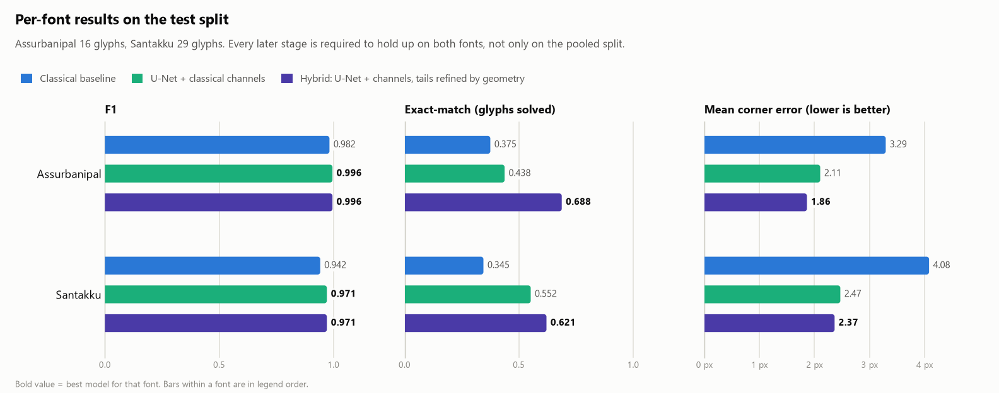

# Stage 4 report: hybrid refinement

Proposer: `checkpoints/unet_xc/best.pt`. Match threshold 10 px, frozen Stage 1 metric unless stated. Hybrid settings were chosen on the validation split; test is reported once.

## Charts

## Ablation

| Configuration | Split | Precision | Recall | F1 | Corner err | Apex | Heads | Tail | Exact | Note |
|---|---|---|---|---|---|---|---|---|---|---|
| Classical baseline (Stage 2) | val | 0.965 | 0.977 | 0.971 | 4.32 | 1.73 | 4.55 | 6.44 | 0.533 |  |
| Classical baseline (Stage 2) | test | 0.945 | 0.970 | 0.957 | 3.78 | 1.60 | 3.74 | 6.04 | 0.356 |  |
| Learned: unet_xc (Stage 3) | val | 0.981 | 0.992 | 0.986 | 3.11 | 1.50 | 3.06 | 4.82 | 0.622 |  |
| Learned: unet_xc (Stage 3) | test | 0.968 | 0.993 | 0.980 | 2.33 | 1.39 | 2.11 | 3.71 | 0.511 | proposer |
| Hybrid, ink check only | val | 0.981 | 0.992 | 0.986 | 3.11 | 1.50 | 3.06 | 4.82 | 0.622 |  |
| Hybrid, ink check only | test | 0.968 | 0.993 | 0.980 | 2.33 | 1.39 | 2.11 | 3.71 | 0.511 |  |
| Hybrid, tail to nearest traced node | val | 0.981 | 0.992 | 0.986 | 3.25 | 1.50 | 3.06 | 5.36 | 0.600 |  |
| Hybrid, tail to nearest traced node | test | 0.968 | 0.993 | 0.980 | 2.39 | 1.39 | 2.11 | 3.92 | 0.511 | naive refinement |
| Hybrid, tail by heatmap vote along the trace | val | 0.981 | 0.992 | 0.986 | 2.98 | 1.50 | 3.06 | 4.29 | 0.689 |  |
| Hybrid, tail by heatmap vote along the trace | test | 0.968 | 0.993 | 0.980 | 2.18 | 1.39 | 2.11 | 3.08 | 0.644 | **shipped configuration** |
|   + snap head tips to skeleton endpoints | val | 0.981 | 0.992 | 0.986 | 3.05 | 1.50 | 3.21 | 4.29 | 0.689 |  |
|   + snap head tips to skeleton endpoints | test | 0.968 | 0.993 | 0.980 | 2.27 | 1.39 | 2.29 | 3.08 | 0.644 |  |
|   + orientation swap rule | val | 0.981 | 0.992 | 0.986 | 2.97 | 1.50 | 3.10 | 4.18 | 0.644 |  |
|   + orientation swap rule | test | 0.968 | 0.993 | 0.980 | 2.31 | 1.39 | 2.35 | 3.16 | 0.644 |  |

## Per font on test

| Font | Model | F1 | Corner err | Tail | Exact |
|---|---|---|---|---|---|
| Assurbanipal | Classical baseline (Stage 2) | 0.982 | 3.29 | 5.09 | 0.375 |
| Assurbanipal | Learned: unet_xc (Stage 3) | 0.996 | 2.11 | 3.59 | 0.438 |
| Assurbanipal | Hybrid, tail by heatmap vote along the trace | 0.996 | 1.86 | 2.63 | 0.688 |
| Santakku | Classical baseline (Stage 2) | 0.942 | 4.08 | 6.64 | 0.345 |
| Santakku | Learned: unet_xc (Stage 3) | 0.971 | 2.47 | 3.78 | 0.552 |
| Santakku | Hybrid, tail by heatmap vote along the trace | 0.971 | 2.37 | 3.36 | 0.621 |

## Secondary metric: predictions within 14 px of a non-wedge stroke are skipped

Tail-less triangles and the malformed stroke are real heads without a wedge label, so a detection there is unscoreable rather than wrong. The training loss already ignores those regions. This table is informational; the frozen metric above remains the headline.

| Configuration | Split | Precision | Recall | F1 | Corner err | Apex | Heads | Tail | Exact | Note |
|---|---|---|---|---|---|---|---|---|---|---|
| Classical baseline (Stage 2) | test | 0.960 | 0.970 | 0.965 | 3.78 | 1.60 | 3.74 | 6.04 | 0.356 |  |
| Learned: unet_xc (Stage 3) | test | 0.990 | 0.993 | 0.992 | 2.33 | 1.39 | 2.11 | 3.71 | 0.533 |  |
| Hybrid, tail by heatmap vote along the trace | test | 0.990 | 0.993 | 0.992 | 2.18 | 1.39 | 2.11 | 3.08 | 0.667 |  |

## Failure classes on test

| Failure class | classical | unet_xc | hybrid |
|---|---|---|---|
| head tip off by >10 px | 27 | 0 | 0 |
| head tip off by >10 px (rare orientation) | 4 | 0 | 0 |
| prong and tail swapped | 6 | 12 | 12 |
| tail stopped early (>10 px short) | 12 | 13 | 6 |
| tail overshoot or sideways (>10 px) | 16 | 9 | 2 |
| tail off by >10 px (rare orientation) | 9 | 11 | 11 |
| near miss: FN with a prediction 10-20 px away | 8 | 2 | 2 |
| near miss: FP within 10-20 px of a wedge | 10 | 3 | 3 |
| missed wedge (FN, nothing nearby) | 1 | 0 | 0 |
| spurious wedge (FP, nothing nearby) | 7 | 7 | 7 |

## Confidence

Per-wedge confidence is the weakest of the network's apex score and its heatmap support at the tail end and both head tips, times 0.6 when the tail points in a rare direction. A glyph's confidence is the minimum over its wedges. A wedge counts as correct when matched with every point within 5 px.

| Split | Wedge AUROC, confidence | Wedge AUROC, apex score only | Glyph AUROC, confidence |
|---|---|---|---|
| val | 0.796 | 0.582 | 0.882 |
| test | 0.719 | 0.520 | 0.867 |

Triage on test: sort glyphs by confidence and keep the most confident fraction.

| Most confident | Glyphs | Fully correct within 5 px |
|---|---|---|
| 25% | 11 | 0.727 |
| 50% | 22 | 0.545 |
| 75% | 34 | 0.441 |
| 100% | 45 | 0.333 |

## Ship decision

On validation the hybrid scores objective 1.646 against 1.578 for the learned model alone (exact-match 0.689 vs 0.622, tail error 4.29 vs 4.82 px). On test: exact-match 0.644 vs 0.511, tail error 3.08 vs 3.71 px, corner error 2.18 vs 2.33 px. Recommended configuration: **hybrid**.

Failure gallery of the hybrid on test: `reports/stage4/gallery/hybrid_test_01.png`, `reports/stage4/gallery/hybrid_test_02.png`

